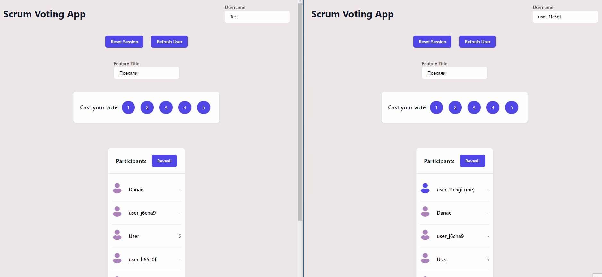

# Overview

From a code challenge:

The goal is to implement a web application that will be used by a remote scrum team, during
their sprint planning session, to privately vote on the complexity score of a single story
(task/feature to be implemented).

## Tech stack

- React & Redux
- Tailwind CSS
- Firebase

## Demo

Live: https://manos-liakos.dev/scrum-voting-app/

## Features

- Full-fledged real-time implementation (all updates happen real-time).
- Each client gets assigned a default username when first visiting the app.
- User refresh functionality (create a new user)
- Any participant can edit his/her username, as well as the feature title.
- Any participant can vote and reveal all votes, effectivelly ending the session.
- While votes are hidden, any participant that has voted gets a "Voted!" message next to his/her username.
- When votes are revealed, users get reordered based on their votes. After that, anyone is able to reset the session, clearing all votes and resetting the feature title.

## Installation

### Using the development build

1. Download and install the latest LTS version of Node.js.
2. Open a terminal in root directory and run 'npm install', to install all the necessary node modules.
3. When finished run 'npm start' to start the development server.
4. Open a browser and visit 'localhost:3000'.

### Using the production build

1. Open a terminal in root directory and run "npm run-script build".
2. Once project building is finished, run "npm install -g serve" to install a local static file server.
3. Run "serve -s build" to start the app.
4. Visit localhost:5000 (see instructions in terminal).
